# 基于深度学习的波函数预测

## 1. 科学技术原理
### 1.1 波函数
量子力学是反映微观粒子（分子、原子、原子核、基本粒子等）运动规律的理论，他是 20 世纪 20 年代在总结了大量实验事实和旧量子理论的基础上建立起来的，随着量子力学的出现，人类对于物质微观结构的认识日益深入，从而能较深刻地掌握物质的物理和化学的性能及其变化的规律，为利用这些规律于实际开辟了广阔的途径，原子核、固体等的性质都能从以量子力学为基础的现代理论中得到阐明，量子力学不仅是物理学中的基础理论之一，而且在化学、材料学、生物学和宇宙学等有关学科和许多近代技术中心也得到了广泛的应用。
黑体辐射和光电效应等现象使人们发现了光的波粒二象性，在此启示下，开始认识到微观粒子的波粒二象性。 以微观粒子的波粒二象性，引入描述微观粒子状态的波函数，建立非相对论量子力学的基本方程——薛定谔方程。
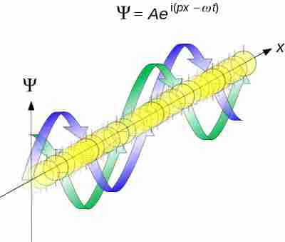
为了表示微观粒子（简称为粒子）的玻粒二象性，可以用平面波来描写自由电子，平面波的频率和波长与自由粒子的能量和动量由德布罗意关系联系起来，平面波的频率和波矢都是不随时间或空间位置改变的，这和自由粒子的能量和动量不随时间或空间位置改变而相对应， 如果粒子受到随时间或空间位置变化的力场的作用，其动量和能量不再是常量，这时粒子就不能用平面波来描写，而必须用更加复杂的波来描写，在一般情况下，我们用一个波函数表示描写粒子的波，并这个函数为波函数，它是一个复数，描写自由粒子的德布罗意平面波是波函数的一个特例。

知道描写微观体系的波函数，由波函数振幅绝对值的平方，就可以得出粒子在任意一点出现的概率。波函数（也称为概率波）描写体系的量子状态（简称状态或态）。在量子力学中，微观粒子具有波粒二象性，粒子的坐标和动量不可能同时具有确定值。当粒子处于某一量子状态时，它的力学量（坐标，动量）一般有许多可能值，这些可能值各自以一定的概率出现，这些概率都可以由波函数得出。
由于粒子必定要在空间某一点出现，所以粒子在空间各点出现的概率综和为 1，因而粒子在空间各点出现的概率只决定波函数在空间各点的相对强度，而不决定强度的绝对大小。

对于一般的情况, 如果 $\Psi_{1}$ 和 $\Psi_{2}$ 是体系的可能状态, 那么, 它们的线性叠加 也是这个体系的一个可能状态这就是量子力学的叠加原理。

$$
\Psi=c_{1} \Psi_{1}+c_{2} \Psi_{2}\left(c_{1}, c_{2} \text { 是复数 }\right)
$$

上式, $\Psi$ 表示为两个态 $\Psi_{1}$ 和 $\Psi_{2}$ 的线性叠加, 推广到更一般的情况, 态 $\Psi$ 可以 表示为许多态 $\Psi_{1}, \Psi_{2}, \cdots, \Psi_{n}, \cdots$ 的线性叠加。

$$
\Psi=c_{1} \Psi_{1}+c_{2} \Psi_{2}+\cdots+c_{n} \Psi_{n}+\cdots=\sum_{n} c_{n} \Psi_{n}
$$

$c_{1}, c_{2}, \ldots, c_{n}, \ldots$ 为复数，这时叠加态原理描述如下：当 $\Psi_{1}, \Psi_{2}, \ldots$, $\Psi_{n}, \ldots$ 是体系的可能状态时, 它们的线性叠加式也是体系的一个可能状态。 
### 1.2 薛定谔方程
在经典力学中, 当质点在某一时刻的状态为已知时, 由质点的运动方程就 可以求出以后状态任一时刻质点的状态。在量子力学中也是这样, 当微观粒子 在某一时刻的状态为已知时, 以后时刻粒子所处的状态也要由一个方程来决 定，称之为薛定谔方程。

由于建立的是描写波函数随时间变化的方程, 因此它必须是波函数应满足 的含有对时间微商的微分方程。此外还必须满足下面两个条件:

(1)方程是线性的, 即如果 $\Psi_{1}$ 和 $\Psi_{2}$ 都是这方程的解, 那么 $\Psi_{1}$ 和 $\Psi_{2}$ 的线性叠加 $\mathrm{a} \Psi_{1}+\mathrm{b} \Psi_{2}$ 也是方程的解。这是因为根据态叠加原理, 如果 $\Psi_{1}$ 和 $\Psi_{2}$ 都是粒子可能 的状态, 那么 $\mathrm{a} \Psi_{1}+\mathrm{b} \Psi_{2}$ 也应是粒子可能的状态。

(2)这个方程的系数不应包含状态的参量, 如动量、能量等, 因为方程的系 数如含有状态的参量, 则方程只能被粒子的部分状态所满足, 而不能被各种可 能的状态所满足。

平面波描写自由粒子的波函数:

$$
\boldsymbol{\Psi}(\mathbf{r}, \mathbf{t}) = \mathbf{A} \boldsymbol{e}^{\frac{i}{h}\left(p \cdot r - E t\right)}
$$

对时间求偏微商得到：


$$
\frac{\partial \psi}{\partial t}=-\frac{i}{h} \mathbf{E} \psi
$$

对坐求二次偏微商

$$
\frac{\partial^{2} \psi}{\partial x^{2}}=-\frac{P_{x}^{2}}{h^{2}} \psi
$$

同理有

$$
\begin{aligned}
& \frac{\partial^{2} \psi}{\partial y^{2}}=-\frac{p_{y}^{2}}{h^{2}} \psi \\
& \frac{\partial^{2} \psi}{\partial z^{2}}=-\frac{P_{Z}^{2}}{h^{2}} \psi
\end{aligned}
$$

将上式相加得到

$$
\frac{\partial^{2} \psi}{\partial x^{2}}+\frac{\partial^{2} \psi}{\partial y^{2}}+\frac{\partial^{2} \psi}{\partial z^{2}}=\nabla^{2} \psi=-\frac{P^{2}}{h^{2}} \psi
$$

利用自由粒子的能量和动量的关系式:

$$
\mathbf{E}=\frac{P^{2}}{2 m}
$$

式中 $m$ 为粒子的质量, 比较上式, 得到自由粒子波函数所满足的微分方 程:

$$
\mathbf{i} \mathbf{h} \frac{\partial \psi}{\partial t}=-\frac{h^{2}}{2 m} \nabla^{2} \psi
$$

设粒子在力场中的势能为 $U(\mathrm{r})$, 在这种情况下, 粒子的动能和动量的关系:

$$
\mathrm{E}=\frac{P^{2}}{2 m}+\mathrm{U}(\mathbf{r})
$$

上式两边乘以 $\Psi(r, t)$ ，得到 $\Psi(r, t)$ 所满足的微分方程

$$
\mathbf{i} \mathbf{h} \frac{\partial \psi}{\partial t}=-\frac{h^{2}}{2 m} \nabla^{2} \boldsymbol{\psi}+\mathbf{U}(\mathbf{r}) \Psi
$$

上式称为薛定谔波动方程, 或薛定谔方程, 也称为波动方程。

### 1.3 定态薛定谔方程

如果U(r)与时间无关, 则可以用分离变量法进行求解，考虑这一方程的一种特解:

$$
\boldsymbol{\Psi}(\mathbf{r}, \mathbf{t})=\boldsymbol{\Psi}(\mathbf{r}) \mathbf{f}(\mathbf{t})
$$
方程的解可以表示为许多这种特解之和, 将上式代入方程中，并把方程两边用 $\Psi （ r) f(t)$ 去除，得到

$$
\frac{\mathrm{ih}}{f} \frac{d f}{d f}=\frac{1}{\psi}\left[-\frac{h^{2}}{2 m} \nabla^{2} \psi+U(\mathbf{r}) \Psi\right]
$$

因为这个等式的左边只是 $\mathrm{t}$ 的函数, 右边只是 $r$ 的函数, 而 $\mathrm{t}$ 和 $\mathrm{r}$ 是相互 独立的变量, 所以只有当两边都等于同一常量, 等式才能被满足。以 $\mathrm{E}$ 表是这 个常量, 则由等式左边等于 $E$, 有

$$
\operatorname{ih} \frac{d f}{d f}=E f
$$

由等式右边等于 $E$, 有

$$
-\frac{h^{2}}{2 m} \nabla^{2} \psi+\mathbf{U}(\mathbf{r}) \Psi=\mathrm{E} \Psi
$$

上式就是定态薛定谔方程。

### 1.4 深度学习与神经网络
深度学习是一种机器学习的分支，它通过构建和训练神经网络来模拟人类大脑的工作方式。神经网络是深度学习的基本模型，它由大量的神经元（节点）和连接它们的权重组成。

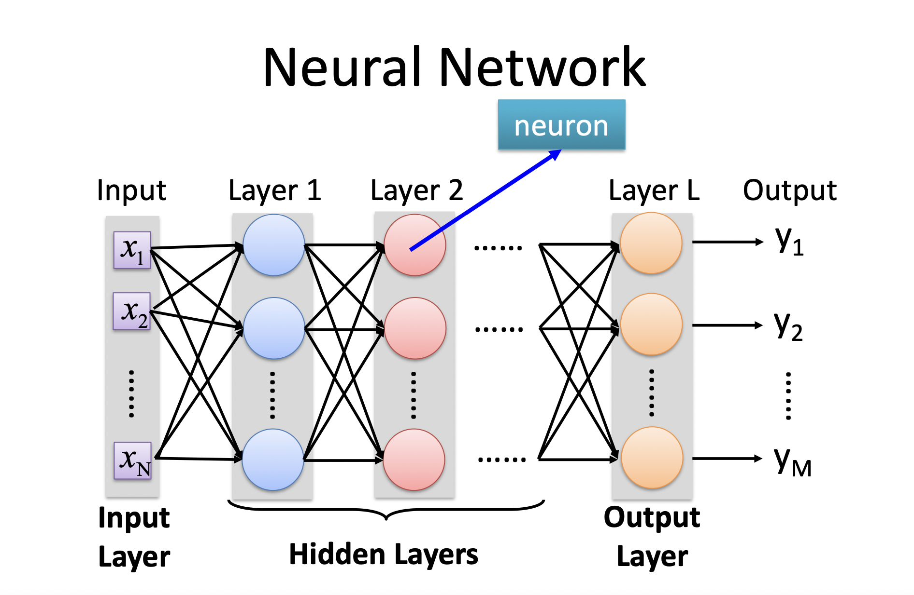
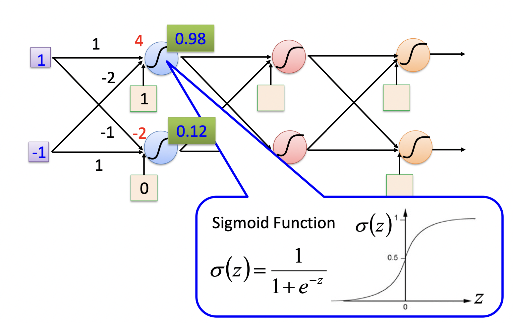
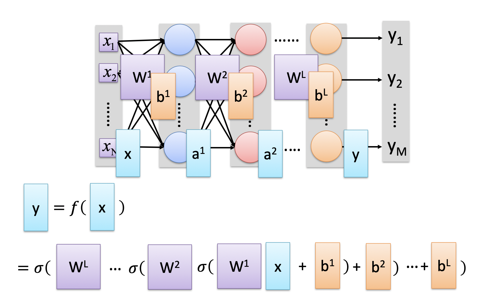

神经网络由多个层次组成，通常包括输入层、隐藏层和输出层。输入层接收原始数据，并将其传递给隐藏层。隐藏层是神经网络的核心，它通过使用非线性激活函数对输入进行处理，并将结果传递到下一层。输出层产生最终的预测或结果。

神经网络的优化基本算法旨在通过调整网络中的权重和偏差，使得网络能够更好地逼近训练数据的真实分布。

深度学习中有很多优化算法，本次实验采用的是最为常见的梯度下降法（ Gradient Descent）。
梯度下降法（Gradient Descent），是一种一阶最优化算法，用于搜索函数的局部极小值。其迭代公式如下：
1. 初始化：选择初始点$x_0$、学习率（learning rate）$\alpha$和迭代次数$N$。
2. 迭代更新：对于每个迭代步骤$k=0, 1, 2, \ldots, N-1$，执行以下操作：
  a.计算梯度：计算当前点$x_k$处的梯度$\nabla f(x_k)$，其中$f(x)$是待优化函数。
  b.更新参数：根据梯度的反方向以学习率$\alpha$的步长进行更新：$x_{k+1} = x_k - \alpha \nabla f(x_k)$
3. 重复步骤2，直到达到预定的迭代次数$N$或满足停止准则（如梯度接近零）。

在每次迭代中，最速下降法根据梯度的反方向进行参数更新，这样可以沿着函数的降低方向前进，从而逐步接近局部极小值点。学习率$\alpha$ 决定了每次更新的步长，较大的学习率可能导致不稳定的更新，而较小的学习率可能导致收敛速度过慢。
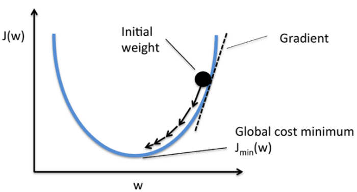
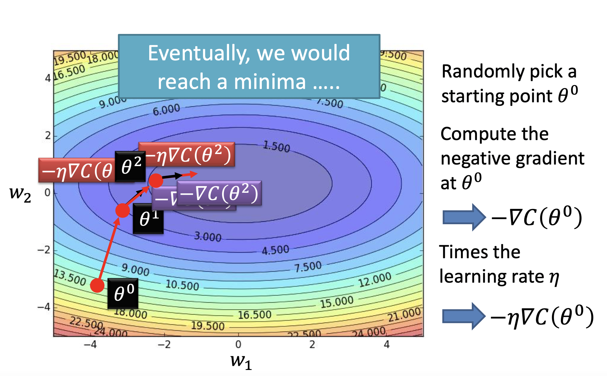

## 2. 设计方案
本次实验的目标是给予深度学习训练出一个根据势能预测波函数的神经网络。
本次实验编写了两个 python文件，分别是`generator.py`和`train.py`
`generator.py`的总体思想是先随机生成 10000 组随机势能（包含阶梯状、锯齿状以及完全随机的状态），求解出这 10000组势能对应的最低能级的波函数。
`train.py`是使用生成的数据训练神经网络，最后使用测试集中的势能来测试神经网络，预测出波函数，并画出图片与真实测试集中的波函数对比。
接下来详细讲解。
#### 随机生成势能
这三个函数分别生成了完全随机的势能、阶梯状的势能和锯齿状的势能。
`generate_random_potential`中的`low`和`high`分别代表了生成的随机势能的下界和上界。
`generate_step_potential`中的`step_height`表示每一层阶梯的长度。
`generate_shape_potential`中的`pattern_length`表示每一个锯齿的长度。
```python
# 生成随机势能
def generate_random_potential(length, low, high):
    return np.random.uniform(low, high, length)

#生成阶梯状的势能
def generate_step_potential(length, step_height):
    num_steps = length // step_height
    potential = np.repeat(np.arange(num_steps), step_height)
    remaining_length = length - len(potential)
    if remaining_length > 0:
        potential = np.concatenate((potential, np.repeat(num_steps, remaining_length)))
    return potential

#生成锯齿状的势能
def generate_shape_potential(length, pattern_length):
    num_patterns = length // pattern_length
    potential = np.tile(np.arange(pattern_length), num_patterns)
    remaining_length = length - len(potential)
    if remaining_length > 0:
        potential = np.concatenate((potential, np.arange(remaining_length)))
    return potential
```
生成的三种势能的样例如下图所示：
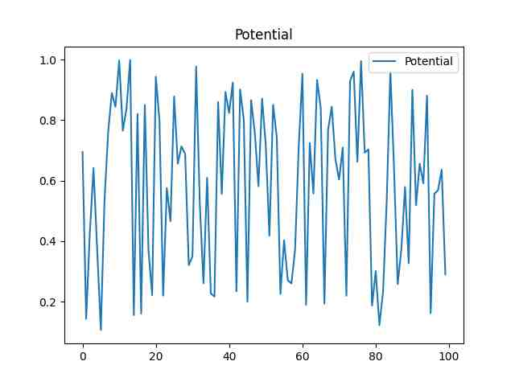
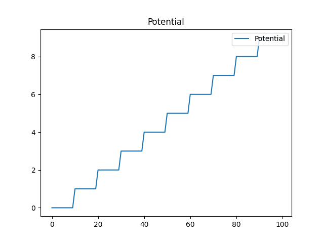
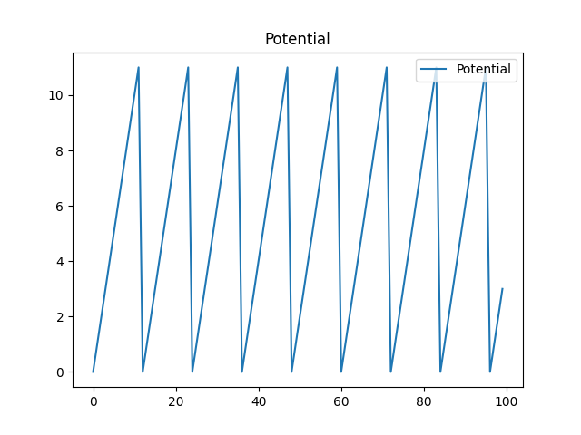

本次实验假设生成势能的范围之外的势能为无穷大，也即在上图中在$x<0$或$x>100$时势能为无穷大。这样能使得计算出来的波函数更直观。
#### 计算波函数
该函数是计算一维势场中的定态波函数。
参数：
potential: array-like, 势能数组
dx: float, 空间步长
mass: float, 粒子的质量（默认为1.0）
返回值：
wave_function: array-like, 定态波函数
返回的是最低能级波函数，也可以通过更改参数来返回最低的好几个能级的波函数
```python
def calculate_wavefunction(potential, dx, mass):
    # 计算势能矩阵
    diagonal = 2.0 * mass / dx**2 + potential
    off_diagonal = -mass / dx**2 * np.ones(len(potential) - 1)
    potential_matrix = np.diag(diagonal) + np.diag(off_diagonal, k=1) + np.diag(off_diagonal, k=-1)

    # 求解薛定谔方程的本征值和本征函数
    eigenvalues, eigenvectors = eigh_tridiagonal(diagonal, off_diagonal)

    # 找到最低的一个能级
    num_levels = min(1, len(eigenvalues))
    lowest_eigenvalues = eigenvalues[:num_levels]
    lowest_eigenvectors = eigenvectors[:, :num_levels]

    # 归一化波函数
    norm = np.sqrt(np.sum(lowest_eigenvectors**2, axis=0))
    normalized_eigenvectors = lowest_eigenvectors / norm
    return normalized_eigenvectors
```
生成的势能和最低能级波函数的图片如下：
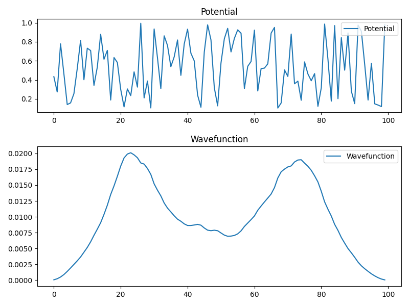
生成的势能和最低和次低能级波函数的图片如下：
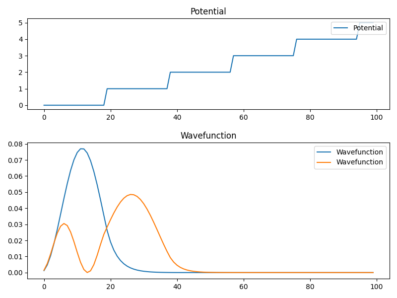

#### 生成训练数据和测试数据
通过随机数来控制生成的三种形态的势能的比例，控制比例大致为$3:1:1$
将生成的势能和波函数数据保存到`.npy`文件中
```python
# 生成训练和验证数据
def generate_data(num_samples, train_ratio):
    potential_data = []
    wavefunction_data = []

    for i in range(num_samples):
        random_integer = random.randint(0, 5)
        if random_integer >=0 and  random_integer <= 3:     #如果随机数为0-3之间则生成完全随机势能
            potential = generate_random_potential(length,low,high)
        elif  random_integer ==4:           #如果随机数为4则生成阶梯状势能
            step_height = random.randint(2,20)
            potential = generate_step_potential(length,step_height)
        elif random_integer == 5:           #如果随机数为5则生成锯齿状势能
            pattern_length = random.randint(1, 12)
            potential = generate_shape_potential(length,pattern_length)

        wavefunction = calculate_wavefunction(potential,dx,mass)
        potential_data.append(potential)
        wavefunction_data.append(wavefunction)
        if i%100 ==0:
            print(f"Already generated:{i}.")
    # 划分训练和验证数据
    train_samples = int(num_samples * train_ratio)
    train_potential = np.array(potential_data[:train_samples])
    train_wavefunction = np.array(wavefunction_data[:train_samples])
    test_potential = np.array(potential_data[train_samples:])
    test_wavefunction = np.array(wavefunction_data[train_samples:])
    # 保存数据
    np.save("data/train_potential.npy", train_potential)           #将势能数据保存到npy文件中
    np.save("data/train_wavefunction.npy", train_wavefunction)     ##将计算出来的波函数数据保存到npy文件中
    np.save("data/test_potential.npy", test_potential)
    np.save("data/test_wavefunction.npy", test_wavefunction)
    return train_potential, train_wavefunction, test_potential, test_wavefunction
```
#### 定义神经网络
定义训练使用的神经网络，采用架构为`pytorch`
```python
class WavefunctionPredictor(nn.Module):
    def __init__(self, input_size, output_size):
        super(WavefunctionPredictor, self).__init__()
        self.fc1 = nn.Linear(input_size, 128)
        self.fc2 = nn.Linear(128, 256)
        self.fc3 = nn.Linear(256, 512)
        self.fc4 = nn.Linear(512, 256)
        self.fc5 = nn.Linear(256, 128)
        self.fc6 = nn.Linear(128, output_size)
        self.relu = nn.ReLU()
    def forward(self, x):
        x = self.fc1(x)
        x = self.relu(x)
        x = self.fc2(x)
        x = self.relu(x)
        x = self.fc3(x)
        x = self.relu(x)
        x = self.fc4(x)
        x = self.relu(x)
        x = self.fc5(x)
        x = self.relu(x)
        x = self.fc6(x)
        return x
```
#### 训练以及预测
初始化一个Adam优化器(optim.Adam)，用于调整神经网络模型的参数。model.parameters()表示需要优化的参数，lr表示学习率。训练总轮数和学习率可以手动调节。每训练100轮打印信息，并动态调整学习率。训练完之后保存模型`model.pth`。
输入预测的势能`test_potential`，返回预测结果`test_outputs`
如果使用CPU的话训练过程较慢，可以使用GPU加速。
```python
criterion = nn.MSELoss()
optimizer = optim.Adam(model.parameters(), lr=lr)
# 训练神经网络模型
t_begin = time.time()
num_epochs = args.round
for epoch in range(num_epochs):
    # 前向传播
    outputs = model(train_potential)
    loss = criterion(outputs, train_wavefunction)
    # 反向传播和优化
    optimizer.zero_grad()
    loss.backward()
    optimizer.step()
    # 打印损失值
    if (epoch+1) % 100 == 0:
        print(f"Epoch {epoch+1}/{num_epochs}, Loss: {loss.item()}")
    #动态调整学习率
    if (epoch+1) == 10000 or (epoch+1) == 40000:
        lr = lr/10
        print(f'Ajust learning rate to:{lr}')
# 测试神经网络模型
model.eval()
with torch.no_grad():
    test_outputs = model(test_potential)
time_cost = time.time()-t_begin
print(f'time cost: {time_cost}')
torch.save(model, 'model.pth')  #保存模型
```
#### 可视化预测结果
使用`matplotlib`来可视化预测结果。橙色曲线代表预测结果，蓝色曲线表示真实波函数。
```python
def generate_image(i):
    fig = plt.figure(figsize=(8, 6))                 
    gs = gridspec.GridSpec(2, 1, height_ratios=[1, 1.5])   # 创建包含两个子图的画布
    
    ax1 = plt.subplot(gs[0])
    ax1.plot(test_potential[i], label='Potential')   # 在第一个子图中绘制势能函数
    ax1.set_title('Potential')
    
    ax2 = plt.subplot(gs[1])
    ax2.plot((test_wavefunction[i]) ** 2, label='Actual Wavefunction')  # 在第二个子图中绘制波函数
    ax2.plot((test_outputs[i]) ** 2, label = 'Predicted Wavefunction')
    ax2.set_title('Wavefunction')     
    ax1.legend(loc='upper right')      # 添加势能函数图例
    ax2.legend(loc='upper right')      # 添加波函数图例

    plt.tight_layout(h_pad=1.5)  # Adjust the vertical spacing between subplots
    plt.savefig(f"pic_of_predict/sample_{i+1}.png")      
    plt.close()
for i in range(num_samples):
    generate_image(i)
```
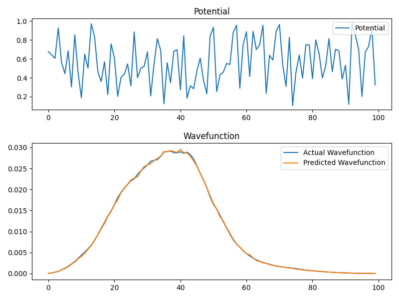

可以看出拟合结果十分不错。

## 3. 创新性描述
实验400余行代码全部由本人完成。
我认为创新性有以下几点：
1. 通过深度学习来求解量子力学中的问题，之后可以直接通过模型预测就能得到波函数，而不需要再次进行复杂的计算
2. 当无法找到足够的数据时，可以直接使用科学计算的方法，自己构建出足够的数据。（本次实验就是随机生成势能后计算出波函数，从而获得足够的数据来训练模型）
3. 在代码运行很慢时考虑使用多线程加速或者使用更强大的计算资源
4. 输入的参数比较灵活，可以自行调整多个参数。

## 4. 运行方法和参数设置
实验环境:
```txt
Linux 操作系统
python 3.6
GPU：NVIDIA GeForce RTX 3090
```
运行方法：
先在终端中运行命令
```bash
python generator.py --num 10000 --dx 0.2 --mass 1
```
其中`num`是生成的数据总量，`dx`是步长，`mass`是粒子质量。除此之外，可以手动调节的参数还有：
```txt
train_ratio  # 训练数据所占比例
length       # 势能数组的长度
low = 0.1    #随机生成势能的最小值
high = 1.0   #随机生成势能的最大值
```
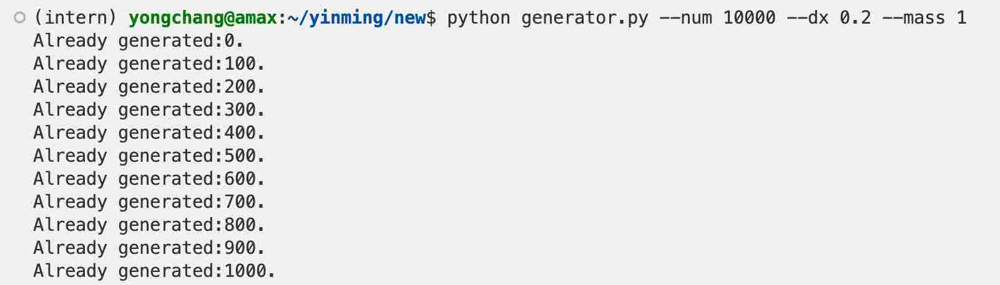
运行过程中会输出已经生成的数据数量。
运行完上述命令之后，会获得生成的势能和波函数。
可视化图片会保存在目录`\pic_of_wavefunction`中
`.npy`文件保存在`\data`中。

其次运行命令
```bash
python train.py --device gpu --lr 1e-5 --round 50000
```
其中`device`指定了使用GPU进行训练，`lr`为学习率，`round`为训练总轮数。
运行该命令后，便会开始训练,并在训练过程中打印出损失率和训练轮数。
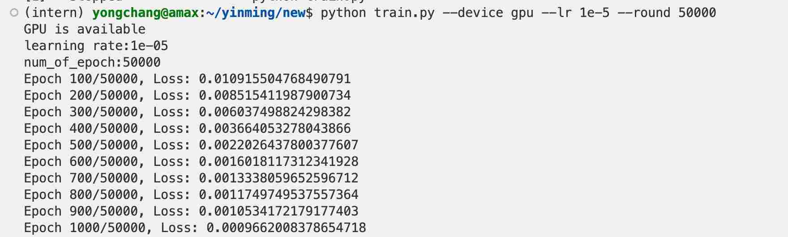
到最后可以发现，损失率会降低到`1e-6`量级。
在GPU的加速下，训练`50000`轮只需要`180s`左右。
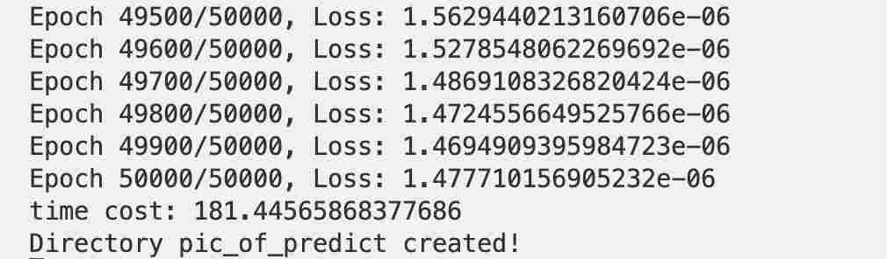

### 实验结果：
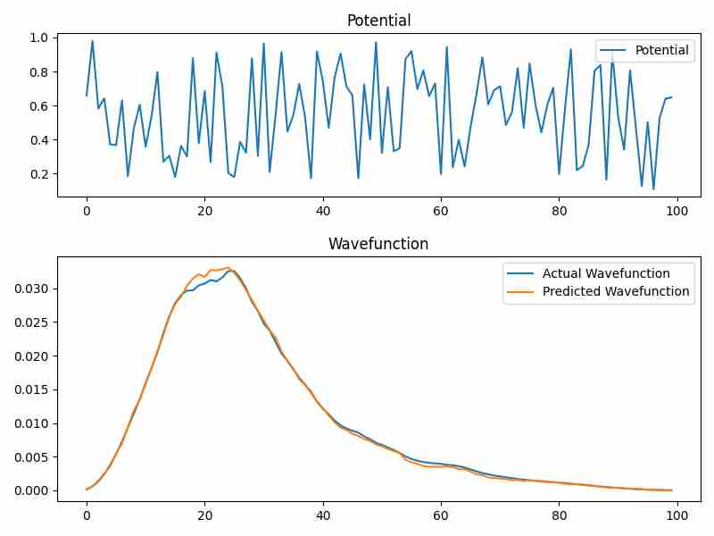
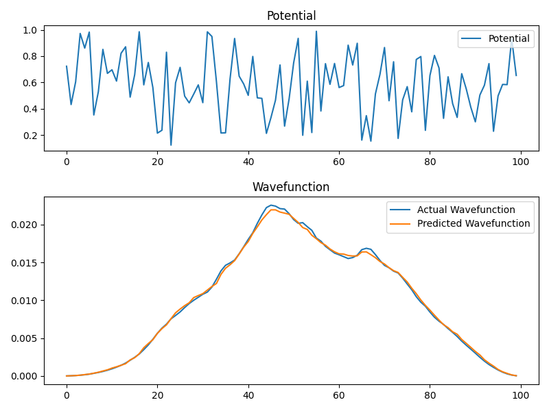
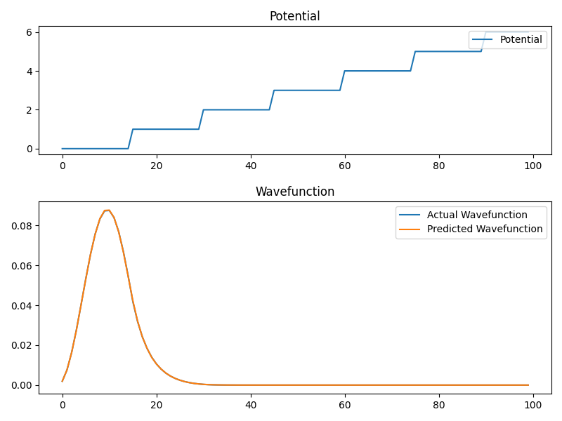
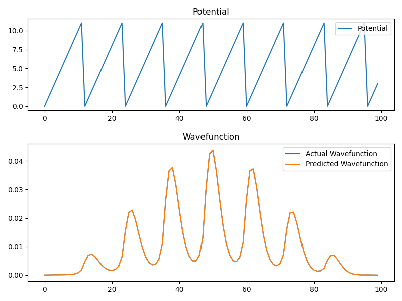

通过对比`Actual Wavefunction`以及`Predicted Wavefunction`,结合损失率，综合分析可以发现拟合结果十分不错。

## 5. 学习心得和收获

1. Python拥有丰富的数据科学生态系统，如NumPy、Pandas、SciPy和Matplotlib等库，学习这些内容使得数据分析和科学计算变得更加简单和高效。
2. 学会了插值、代数方程求解、最优化等算法，在未来能够带来很多帮助。
3. 本次大作业让我明白了解决科学计算问题可以借助AI这一强大工具，帮助我们更好的进行科学计算。
4. Python还可以与其他编程语言（如C/C++）进行集成，更加能够拓展编程能力。
5. 之前的一些课程往往都是只要求同学们完成自己的大作业然后提交即可，缺乏让每一位同学讲解自己大作业的机会。其实这一点是非常重要的，以后的毕业论文答辩包括论文投稿也需要我们讲出我们自己所做的工作。所以这门课还有一个很大的收获就是锻炼了我的口头表达能力，能够将自己做的项目完整讲出来。

## 参考资料
[1]罗奇鸣.Python科学计算基础 2023
[2]格里菲斯.量子力学概论 1982


## 讲解日期

2023年6月8日